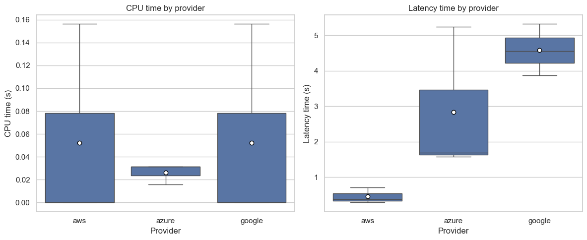

# Projeto #2 - Comparativo entre serviços de Nuvem

## Equipe:
- Carlos Duarte - matr. 2527530
- Jonas de A. Luz Jr. - matr. 2519171
----

## Objetivo:
> Fonte: [Especificação do projeto 2](https://docs.google.com/presentation/d/1p3TuMcKrhY4QGYSbf0cn0Cd3kdcL1pLtybFAYhWL7XE/edit?slide=id.g4f3c9c9561_0_334#slide=id.g4f3c9c9561_0_334)

1. Selecionar um subconjunto dos serviços que compõem o catálogo de serviços identificados no Trabalho I, cujas principais funcionalidades sejam oferecidas pelos três provedores de nuvem investigados, quais sejam, Amazon, Google, e Microsoft.
2. Especificar, implementar, e gerar dados de teste para uma aplicação que utilize e avalie a acurácia/eficiência do subconjunto de serviços selecionado no item 1, no contexto de um provedor específico. 
3. Coletar os dados dos testes e comparar os serviços equivalentes selecionados de cada provedor em termos de sua acurácia/eficiência

## Descrição do Serviço Selecionado
O serviço selecionado foi o Text to Speech (TTS), que converte texto em fala. Esse serviço é amplamente utilizado em diversas aplicações, como assistentes virtuais, leitores de tela para deficientes visuais, e sistemas de resposta automática.

## Metodologia
Para avaliar os serviços de TTS dos três provedores de nuvem (Amazon Polly, Google Text-to-Speech e Microsoft Azure Text to Speech), seguimos os seguintes passos:

1. **Seleção de Frases de Teste**: Criamos um conjunto diversificado de frases que incluem diferentes estilos de escrita, sotaques e complexidades linguísticas.
2. **Implementação da Aplicação**: Desenvolvemos um [notebook Jupyter em Python](Speech.ipynb) que utiliza as APIs dos três serviços de TTS para converter as frases de teste em áudio.
3. **Coleta de Dados**: Para cada frase, coletamos o tempo de execução e os arquivos de áudio gerados por cada serviço.
4. **Avaliação da Qualidade**: Realizamos uma avaliação qualitativa dos arquivos de áudio gerados, considerando aspectos como naturalidade, clareza e fluidez da fala.
5. **Análise Comparativa**: Com base na avaliação qualitativa, comparamos os serviços em termos de qualidade do áudio gerado.

## Resultados
Com base nos experimentos executados (36 amostras por provedor), obtivemos as seguintes métricas de desempenho para CPU time (tempo de CPU) e Latency time (latência = wall − CPU):

- AWS Polly — mediana: CPU ≈ 0,000 s; Latência ≈ 0,234 s (Q1 ≈ 0,217; Q3 ≈ 0,247)
- Microsoft Azure — mediana: CPU ≈ 0,031 s; Latência ≈ 1,207 s (Q1 ≈ 1,150; Q3 ≈ 1,229)
- Google TTS — mediana: CPU ≈ 0,000 s; Latência ≈ 4,587 s (Q1 ≈ 4,153; Q3 ≈ 5,722)

Principais achados:
- Em latência, a AWS apresentou menor tempo mediano (≈ 0,23 s), seguida pela Azure (≈ 1,21 s) e, por último, a Google (≈ 4,59 s).
- O tempo de CPU foi baixo e semelhante entre os provedores (mediana ≈ 0,00–0,03 s), indicando que a diferença prática decorre majoritariamente do tempo de espera de rede/serviço.
- A dispersão (IQR) da latência foi pequena na AWS e Azure e maior na Google, sugerindo maior variabilidade de resposta neste último.

A figura abaixo resume graficamente a distribuição de tempos por provedor por meio de boxplots (CPU e Latência), conforme gerado no notebook `Speech.ipynb`.

Observação: Todos os resultados da análise foram salvos na tabela `results` no banco `project-2.sqlite`, preenchida durante a execução do notebook.
