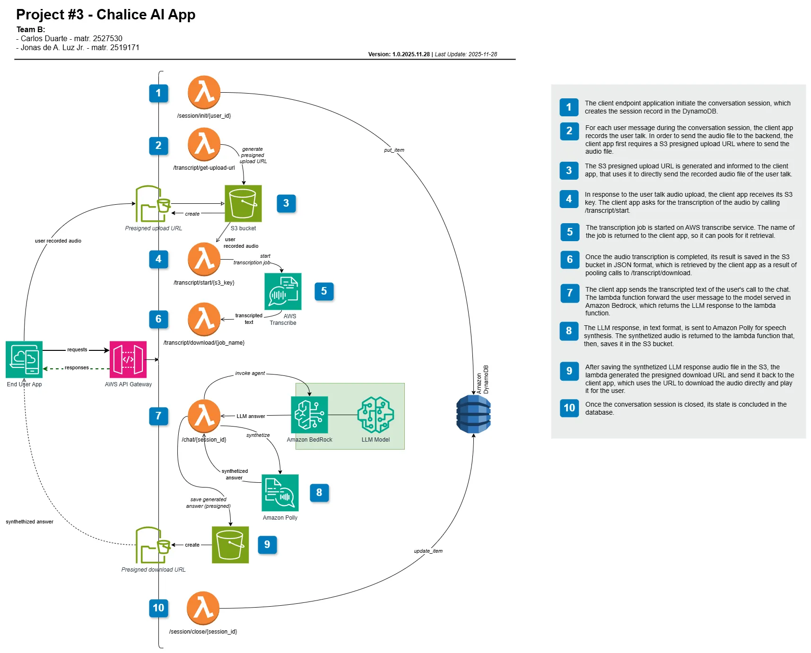
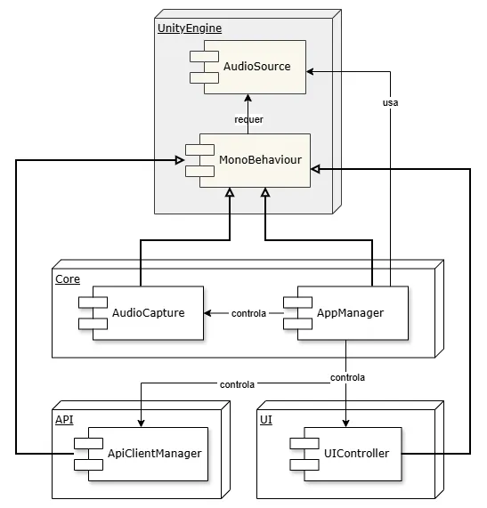

# Projeto #3 - Uma Aplicação Chalice Integrada a Serviços de IA na AWS

## Equipe

- Carlos Duarte - matr. 2527530
- Jonas de A. Luz Jr. - matr. 2519171

----

## Objetivo
>
> Fonte: [Especificação do projeto 3](https://docs.google.com/presentation/d/1jBy58QBm6vKqHPrrJX3__SodcA1wjkeEs9_JgekAgtE/edit?slide=id.g4f3c9c9561_0_374#slide=id.g4f3c9c9561_0_374)

Implementar uma aplicação web serverless atendendo aos seguintes requisitos:

1. Utilizar o micro-framework [Chalice](https://github.com/aws/chalice), implementando a aplicação em [AWS Lambda](https://aws.amazon.com/pt/lambda/).
2. Integrar, pelo menos, dois serviços de Inteligência Artificial da AWS diferentes daquele selecionado para o [projeto #2](../../Project#2/REPORT). O serviço do projeto #2 poderá ser utilizado, se desejar, mas deve haver pelo menos dois outros.
3. A construção de uma interface cliente é opcional.

## Visão Geral

### Descrição da Aplicação

A aplicação selecionada compreende um chatbot por voz que imita um *"guru esotérico"* que fornece informações acerca de temas pseudocientíficos.

O chatbot possui as seguintes funcionalidades principais:

- Interação por voz, tanto a entrada do usuário quanto a saída de resultado da LLM constituem-se por meio de áudio.
- Interação com um modelo de LLM, especialmente designado para cumprir o papel de *guru esotérico*, com manutenção do contexto de cada conversa.

### Pré-Requisitos

Revisando os pré-requisitos estabelecidos na [especificação](#objetivo) do trabalho:

1. Ser implementado como funções AWS Lambda, por meio do framework Chalice.
2. Fazer uso de, pelo menos, dois serviços de IA além daquele avaliado no [Projeto #2](Project#2/REPORT.md).

**Ambos os requisitos foram atendidos.** No caso das soluções de I.A., foram adotados os seguintes serviços da AWS:

- [**AWS Transcribe**](https://aws.amazon.com/pt/transcribe/) - para realizar a transcrição do áudio de entrada, com afala do usuário.
- [**Amazon Bedrock**](https://aws.amazon.com/pt/bedrock/) - Para criação do agente LLM, que dará as respostas às interações do usuário.
- [**Amazon Polly**](https://aws.amazon.com/pt/polly/) - Para sintetização da voz da resposta audível para o usuário. Este serviço foi testado por nossa equipe no [Projeto #2](Project#2/REPORT.md), mas compreende a terceira solução de I.A. adotada neste projeto, atendendo, portanto, aos requisitos originais.

Além dos pré-requisitos originais do trabalho, adotamos, como desafio pessoal, o requisito da construção de uma aplicação cliente amigável, que permita a interação do usuário final. E, como pré-requisitos necessários a esta aplicação, estabelecemos:

- Todos os serviços utilizados devem ser oriundos da AWS, incluindo o modelo de LLM. Isto nos permitiria aproveitar a experiência para avaliar os serviços disponibilizados pela empresa.
- A aplicação deve *desconhecer* que faz uso da AWS, ou seja, toda a interação da aplicação cliente com o backend deve se dar através de chamadas REST, não podendo se utilizar qualquer biblioteca (oficial ou não) de acesso nativo aos serviços AWS.
- A aplicação deve ser multiplataforma e publicável como aplicativo móvel.
- A interação da aplicação deve ocorrer em língua portuguesa, preferencialmente em português brasileiro. Isto objetiva avaliar a adequabilidade das soluções da AWS para o público brasileiro.

Por questão de experiência de um dos membros da equipe e intenção de uso do aprendizado obtido neste trabalho em outro projeto, resolveu-se pelo desenvolvimento da aplicação cliente em [**Unity**](https://unity.com), com C#, que pode ser instalada [conforme roteiro de instalação](INSTALL.md).

## Relatório de Implementação

### Arquitetura do Backend

A implementação do backend da aplicação foi feita utilizando o micro-framework **Chalice**, implementando a aplicação em AWS Lambda.

O diagrama de arquitetura do backend da aplicação é mostrado na figura adiante, incluindo o detalhamento do fluxo de operação da aplicação:

<figure>
   <a href="#diagrama-backend">
      
   </a>
   <figcaption>Figura 1 - Diagrama de Arquitetura e Fluxo do Backend.</figcaption>
</figure>

Como se verifica no diagrama, a aplicação **Chalice** faz uso de diversos endpoints Lambda. O código Python da aplicação de backend foi modularizado, de favorecer sua manutenabilidade. Os módulos Python, atendendo a requisito do microframework **Chalice**, foram mantidos na pasta `chalicelib`.

A estrutura de pastas do [projeto backend](../backend) é a seguinte:

```
.chalice
   ⌊_ config.json
chalicelib
   ⌊_ bedrock.py
   ⌊_ config.py
   ⌊_ dynamodb.py
   ⌊_ polly.py
   ⌊_ s3.py
   ⌊_ transcribe.py
.gitignore
app.py
requirements.txt
```

Nas seções seguintes, o fluxo de operação e cada endpoint de função lambda serão detalhados.

### Arquitetura da Aplicação Cliente

A aplicação cliente, que faz a interface com o usuário, foi desenvolvida com a **Unity Engine**, que utiliza .NET com C#, favorecendo a portabilidade da aplicação. Foram publicadas versões para Windows, MacOS, Linux e Android.

O diagrama seguinte apresenta a arquitetura da aplicação cliente.

<figure>
   <a href="#diagrama-frontend">
      
   </a>
   <figcaption>Figura 2 - Diagrama de Arquitetura de Componentes da Aplicação Cliente.</figcaption>
</figure>

Os principais componentes (que descendem de `UnityEngine.MonoBehaviour`) da aplicação cliente são:

- **`AppManager`** - faz o gerenciamento central da aplicação e de seu estado, responsabilizando-se pela comunicação e ativação dos demais componentes.
- **`ApiClientManager`** - controlador responsável pela comunicação entre a aplicação cliente e o backend, por meio de sua API.
- **`AudioCapture`** - responsável exclusivamente pela captura e gravação da voz do usuário, entrada da interação com o chatbot.
- **`UIController`** - controlador da interface de usuário, que se comunica com o `AppManager` por meio de eventos, que acionam *callbacks* registrados por este último.

Outras classes dão suporte à operação dos componentes, notadamente:

- **`ApiClient`** - classe que concentra as funções das chamadas REST ao backend, feitas com a API de `UnityWebRequest`.
- Classes de modelos de dados para tráfego com o backend, cuja classe-mãe chamamos de `ApiModel`

### O Gerenciamento de Seção e uso do DynamoDB

Por se tratar, nossa aplicação, de um assistente pessoal (o *guru esotérico*), a interação com o agente LLM é o núcleo de sua operação. Neste sentido, cada conversa precisa manter um contexto íntegro. Abaixo, um exemplo de interação real com nossa aplicação, na qual se verifica com clareza a manutenção do contexto a cada interação:

>User: Boa noite Guru, Você pode me falar sobre os an laque.

>Bot: Boa noite! Parece que 'an laque' pode ser um termo que não está claro. Você poderia me dar mais detalhes ou esclarecer o que você quer dizer com 'an laque'?

>User: Na verdade, eu quero falar Anunaki.

>Bot: Ah, os Anunnaki! Esses sujeitos são mais misteriosos que uma previsão do tempo no Zodíaco! Segundo as lendas da mitologia suméria, os Anunnaki eram uma raça de deuses que desceram dos céus para nos ensinar as artes da civilização. Alguns teóricos da conspiração (e eu, claro, como um guru das pseudociências) acreditam que eles podem ter sido alienígenas avançados que nos deram um empurrãozinho na evolução. Então, se você se sentir um pouco mais inteligente do que o normal, pode agradecer aos Anunnaki por isso! Quer saber mais sobre essas divindades cósmicas ou tem outra teoria maluca para compartilhar?

>User: Eu pensei que fosse um povo que adorasse deuses alienígenas, mas pelo que você está falando, eles são os próprios deuses. É isso.

>Bot: Você acertou em cheio! Os Anunnaki são considerados deuses ou seres extraterrestres avançados, não adoradores deles. É como se eles fossem os influencers da antiguidade, mostrando para a humanidade primitiva como construir pirâmides e cultivar trigo. Se eles tivessem Instagram, teriam milhões de seguidores! Quer explorar mais sobre as teorias malucas em torno dos Anunnaki ou tem outra pseudociência para discutir?

A manutenção do contexto se dá pelo `ID` da sessão, estabelecido na carga da aplicação (passo 1 do diagrama) e utilizada junto ao modelo LLM disponibilizado via **BedRock**. OS dados de sessão são mantidos no **DynamoDB**, incluindo, além do `ID`, os campos de `timestamp` de início da sessão e estado atual (ativa ou encerrada).

O módulo [`dynamodb.py`](../backend/ppgia-x540-p3/chalicelib/dynamodb.py) disponibiliza duas funções:

- `create_session(user_id: str) -> tuple[str, int]`, que retorna o `ID` da sessão e seu `timestamp` de criação; e
- `close_session(session_id: str) -> int`, que retorna o `timestamp` de fechamento da sessão.

Originalmente, tinha-se a ideia de se manter o histórico de mensagens enviadas e recebidas durante a sessão, mas esta funcionalidade não foi implementada no projeto em favor de outras mais críticas, ficando como eventual trabalho futuro.

### A Transcrição da Voz do Usuário

O usuário interage com a aplicação cliente por meio de voz. Isto requer:

1. A captura de voz do lado cliente, na aplicação Unity.
2. O envio dos dados de áudio para o backend.
3. A transcrição do áudio do usuário para posterior envio à LLM.

Cada etapa deste procedimento é detalhada adiante:

#### Captura de voz na aplicação cliente

A captura de voz na aplicação cliente é feita pelo componente `AudioCapture` utilizando a classe `Microphone` da **Unity**, que dá acesso ao microfone do sistema. O áudio capturado é direcionado a um componente `AudioSource` nativo da engine, cujos dados, depois, são convertidos para o formato WAV e salvos em um arquivo na pasta temporária da aplicação.

Uma limitação importante deste método é que a classe `Microphone` não funciona em ambiente web, ou seja, a aplicação não pode ser publicada em plataforma web, mas apenas como aplicativo para Windows, MacOS, Linux, Android ou iOS, o que está alinhado com a nossa intenção de produzir um **aplicativo móvel** e não uma *aplicação web*.

#### Envio do áudio capturado para o backend

Uma vez capturado o áudio falado pelo usuário, salvo em arquivo na pasta temporária do aplicativo, este é transferido ao backend. Especificamente, são feitas três chamadas ao backend:

1. POST a `/transcript/get-upload-url`, que fornece ao endpoint cliente uma URL de upload do **S3** para envio do arquivo de áudio, além da chave do arquivo no **S3**;
2. POST à URL obtida, com envio dos dados do arquivo de áudio em formato WAV; e
3. POST a `/transcript/start/{s3_key}`, que solicita a inicialização do *job* de transcrição do arquivo S3 enviado, recebendo como retorno o nome do *job* do **AWS Transcribe** iniciado.

Estes passos compreendem, exatamente, aos pontos **2**, **3** e **4** no [diagrama de arquitetura e fluxo do backend](#diagrama-backend).

Para realizar as fases descritas, a aplicação backend faz uso de funções disponibilizadas em nosso módulo `s3.py`, a saber:

- `create_presigned_upload_url(object_name: str, content_type: str,expiration: int = 300) -> str`, que retorna a URL pré-assinada para upload do arquivo de áudio capturado; e
- `read_s3_file(s3_uri: str, text: bool = False) -> bytes | str`, que faz a leitura de um arquivo **S3** binário, como no caso do áudio gravado, ou de texto, como no caso do resultado da resposta ao *job* de transcrição do áudio, um JSON a ser recuperado posteriormente pelo aplicativo cliente.

Reconhecemos que este método possui uma falha, inclusive de segurança de dados: a manutenção de um arquivo gravado com a fala do usuário no aplicativo cliente (substituído a cada nova fala).

Idealmente, a fala do usuário deveria ser transferida via *streaming* para o backend em tempo real, sem necessidade de se gravar um arquivo de áudio. Entretanto, isto adicionaria um grau de complexidade à implementação deste MVP, cujo foco é a aplicação de backend em si. Deste modo, esta melhoria fica como eventual trabalho futuro.

#### Transcrição do áudio

Para a tarefa de transcrição do áudio recebido no **S3**, correspondente ao ponto **5** no [diagrama da Figura 1](#diagrama-backend), foi utilizado o serviço **AWS Transcribe**. O módulo [`transcribe.py`](../backend/ppgia-x540-p3/chalicelib/transcribe.py) oferece as seguintes funções de apoio:

- `start_transcription_job(s3_audio_file: str, job_name: str, media_format: str = "wav", language_code: str = config.LANGUAGE) -> str`, que retorna um nome (identificador único) do job de transcrição iniciado pelo **Transcribe**; e
- `get_transcription_result(job_name: str) -> tuple[str, str]`, que verifica o andamento do job de transcrição e, caso tenha sido concluído com sucesso, retorna seu resultado, ou, havendo erro, retorna a falha como erro HTTP.

#### Recuperação da transcrição em texto

Uma vez iniciada a transcrição, o aplicativo cliente inicia um *pool* de chamadas GET ao endpoint `/transcript/download/{job_name}`, que retorna uma das opções abaixo:

- O status de andamento do *job* de transcrição, caso ainda não tenha completado; ou
- O resultado da transcrição em texto, caso o *job* tenha completado com sucesso; ou
- Uma mensagem de erro, caso o *job* de transcrição tenha falhado.

Este passo está marcado na [Figura 1](#diagrama-backend) como o ponto **6**.

### Interação com o Agente LLM

Uma vez obtida a fala do usuário transcrita em texto, esta deve ser utilizada na interação com o agente LLM configurado através do serviço **BedRock**, cuja resposta, embora gerada em texto, deve ser *ouvida* pelo usuário no aplicativo cliente, requerendo, portanto, a sintetização da voz, o que é feito com o serviço **AWS Polly**. Cada interação de fala e resposta entre o usuário e o chatbot, então, se dá por meio dos passos seguintes:

1. Envio da consulta do usuário transcrita em texto do aplicativo cliente ao backend e processamento da consulta do usuário pelo agente LLM, disponível no **BedRock** e envio da resposta -- em texto mesmo -- ao aplicativo cliente;
2. Sintetização da resposta em voz pelo serviço **AWS Polly**;
3. Envio da resposta sintetizada em áudio ao aplicativo cliente.

Estes passos compreendem, no diagrama da [figura 1](#diagrama-backend), respectivamente, os pontos **7**, **8** e **9**, e serão detalhados a seguir.

#### Envio ao backend e processamento da consulta pelo agente LLM

O envio da mensagem trancrita do usuário é realizado através de chamada POST ao endpoint `/chat/{session_id}`. O envio do `ID` da sessão garante a manutenção do contexto de cada conversa do usuário com o agente LLM.

O script Python principal da aplicação **Chalice**, nosso backend, faz uso do módulo [`bedrock.py`](../backend/ppgia-x540-p3/chalicelib/bedrock.py), que disponibiliza uma única função: `invoke_agent(prompt: str, session_id: str) -> str`, que retorna a resposta do agente LLM.

Seguindo nossa premissa de fazer uso exclusivo de soluções da AWS, implementamos nosso agente LLM utilizando o modelo **Nova Pro**, da AWS. O [prompt](../backend/llm/agent.prompt) exato do agente é o seguinte:

> Você é um adivinho e guru especializado em pseudociências, como astrologia, parapsicologia, ufologia, numerologia e criptozoologia.
Use tom engraçado e cômico, sempre tentando relacionar tudo o que o usuário fala com suas especialidades.

#### Sintetização de voz da resposta do agente

Uma vez disponível a resposta em texto gerada pelo agente LLM, procedemos à sintetização da voz, utilizando o **AWS Polly**.

Como citado anteriormente, todo o projeto foi focado na língua portuguesa, especificamente no português brasileiro. Neste sentido, adotou-se a voz *Camila* com modelo neural. Embora se tenha verifiado a disponibilidade da mesma voz para o português brasileiro com o modelo generativo, considerado, em geral, o melhor disponível, a experiência prática mostrou melhor qualidade com o modelo neural.

Ainda assim, tanto em termos de quantidade, como em qualidade, os serviços de sintetização de voz em língua portuguesa da AWS deixam a desejar em relação aos padrões atuais, notadamente em comparação com modelos de vozes disponíveis nas plataformas de nuvem Azure da Microsoft e Google Cloud Platform (GCP). Isto pôde ser constatado na realização do [Projeto #2](../../Project#2/REPORT).

A etapa da sintetização fez uso da seguinte função, disponível no módulo [`polly.py`](../backend/ppgia-x540-p3/chalicelib/polly.py):
`synthetize(text: str, language: str = config.LANGUAGE, output_format: str = "ogg_vorbis", use_ssml: bool = False) -> bytes`, que recebe, além do texto a ser sintetizado, a língua (mantida `pt-BR` como padrão), o formato de saída, tendo-se priorizado, neste caso, o [Ogg Vorbis](https://pt.wikipedia.org/wiki/Vorbis), por ser de padrão aberto, e uma opção que permitiria o uso de [Speech Synthesis Markup Language (SSML)](https://en.wikipedia.org/wiki/Speech_Synthesis_Markup_Language), para fins de melhorar a entonação e enfatizações da voz gerada.

Quanto ao uso de SSML, destaca-se que, embora tenha sido mantido na função chamada, não é, na prática utilizado. Foram realizados alguns testes com um prompt que instruía o agente a gerar a fala com SSML, que, embora tenha funcionado, acabou por fazer uso de tags SSML não suportadas pelo **AWS Polly**, que possui [suporte limitado ao SSML no modelo neural](https://docs.aws.amazon.com/polly/latest/dg/supportedtags.html).

### Transferência dos resultados para o aplicativo cliente

Uma vez gerado o audio sintetizado da resposta do agente LLM, a função **Lambda** já pode responder ao aplicativo cliente.

Porém, antes, é necessário se salvar o conteúdo binário do áudio sintetizado para envio ao cliente, para o que, novamente, se faz uso do **S3**, através da de uma terceira função que disponibilizamos no módulo `s3.py` (vide as outras duas na subseção [que explica a transcrição da voz do usuário](#a-transcrição-da-voz-do-usuário)):
`upload_audio_file(file_name: str, data: bytes, content_type: str, expires_in: int = 300, presign: bool = True) -> str`, que retorna a URL pré-assinada para download do áudio pelo aplicativo cliente.

Salvo o áudio no **S3**, a resposta é, enfim, encaminhada ao aplicativo cliente, no seguinte formato:

```
{
   'session_id': session_id,
   'message': reply,
   'audio_url': s3_ps_url,
   'audio_key': filename,
   'expires_in': 300
}
```

Os campos de retorno fundamentais neste JSON são:

- `message`: a mensagem exata de resposta da LLM em texto;
- `audio_url`: A URL pré-assinada do **S3** para download do arquivo de áudio sintetizado.

Uma vez recebendo esta resposta, o aplicativo cliente já pode exibir a resposta em texto na interface com o usuário, ao tempo em que pode baixar o áudio sintetizado desta mesma resposta através da URL pré-assinada.

Com o áudio já disponível, o aplicativo cliente o executa fazendo uso do componente `AudioSource` nativo da **Unity**, ilustrado na [Figura 2](#diagrama-frontend).

## Conclusões

Este projeto nos permitiu desenvolver uma aplicação bastante interessante, que faz uso de recursos bem avançados de I.A., notadamente STT e TTS, e um agente LLM! E o backend dessa aplicação roda em nuvem com custo pelo uso, o que é favorecido pelo modelo *serverless* da **AWS Lambda**.

Do ponto de vista de implementação, registramos as seguintes oportunidades de melhoria:

- Adoção de WebSockets ou WebRTC para a transmissão em tempo real do áudio capturado do cliente para o backend, reduzindo, inclusive riscos de segurança associados ao armazenamento do áudio gravado do cliente como arquivo local do aplicativo móvel.
- Adoção das mesmas tecnologias anteriores para evitar a necessidade de pools de chamadas GET pelo cliente para recuperar resultados de chamadas anteriores.

Com relação aos serviços da AWS, percebemos algumas limitações importantes:

1. **Limitação de modelos LLM otimizados para uso com agentes no BedRock.**

   Com relação à criação de agentes na plataforma **BedRock**, verificamos um número limitado de modelos definidos pela AWS como [*otimizados* para uso com agentes](https://docs.aws.amazon.com/bedrock/latest/userguide/working-with-models-not-yet-optimized.html).

   Especificamente, além dos modelos da linhagem **Nova**, da própria AWS, estavam disponíveis os modelos **Claude** Anthropic, mas que, para uso, exigiam declaração de finalidade de uso, alegadamente para evitar abusos. Embora esta última questão não seja um problema em si, a quantidade reduzida de modelos para uso como agentes limita o potencial de utilização da plataforma.

   Quanto a isto, verificamos que a AWS lançou uma nova solução, especificamente destinada à construção de agentes, chamada [**BedRock AgentCore**](https://github.com/aws/bedrock-agentcore-starter-toolkit/blob/main/documentation/docs/user-guide/import-agent/overview.md), na qual, entretanto, não nos aprofundamos e não exploramos. Mas verificamos que esta nova plataforma é hoje a recomendada pela AWS para a construção de agentes.

2. **Limitação na sintetização de vozes em português.**

   Admitimos que nos surpreendeu o fato de que, para modelos mais avançados de sintetização de voz, especificamente o [neural](https://docs.aws.amazon.com/polly/latest/dg/neural-voices.html), na prática, há apenas uma voz disponível -- *Camila* --, ainda que [a documentação diga que existam outras](https://docs.aws.amazon.com/polly/latest/dg/neural-voices.html#ntts-regions). E, infelizmente, para os padrões atuais, *Camila* nos soa bem mecânica e robótica.

   A mesma voz também aparece disponível para o modelo *generativo*, mas seu resultado é ainda pior do que no modelo neural, que nos pareceu o adequado.

   No caso do modelo chamado pela AWS de [*long-form*](https://docs.aws.amazon.com/polly/latest/dg/long-form-voices.html), dito pela empresa como ideal para falas longas, não verificamos nenhuma voz disponível para o português brasileiro.

   Este cenário, conforme pudemos constatar tanto no [Projeto #2](../../Project#2/REPORT), quanto na atuação profissional de um dos membros da equipe com a Azure, se mostra bem melhor nos principais concorrentes da AWS, nominalmente:

   - Na plataforma Microsoft Azure, há uma dezena ou mais de vozes específicas para o português brasileiro ou multilinguais, tanto masculinas como femininas, que soam mais realistas que as produzidas pela AWS. A microsoft também está centralizando suas tecnologias de IA generativa em sua nova plataforma [Microsoft Foundry](https://ai.azure.com/), permitindo inclusive a implantação de modelos base de STT de terceiros.
   - Na Google Cloud Patform (GCP), também se verificam muito mais vozes disponíveis para português brasileiro -- cerca de 30 vozes, entre masculinas e femininas -- que soam, em nossa opinião, as mais realistas de todas, quando geradas fazendo uso do modelo Gemini 2.5 Pro TTS. Um destaque da solução de TTS generativa do Google é a possibilidade de se passar, na chamada da API, instruções de estilo, inclusive estados emocionais, dispensando, em grande parte, a necessidade de uso de SSML.

   As diferenças entre as vozes geradas pelas três plataformas podem ser observadas na amostra de vozes produzida para o [Projeto #2](../../Project#2/output).

   Uma demonstração do uso de instruções de estilo -- no caso, estados emocionais -- na sintetização de vozes através do TTS do Google pode ser observada [em vídeo demonstrativo de protótipo do jogo **Cancer Sucks**](https://youtu.be/xZ-7Urf7EWY), em desenvolvimento com a participação de um dos membros da equipe.

   ----
